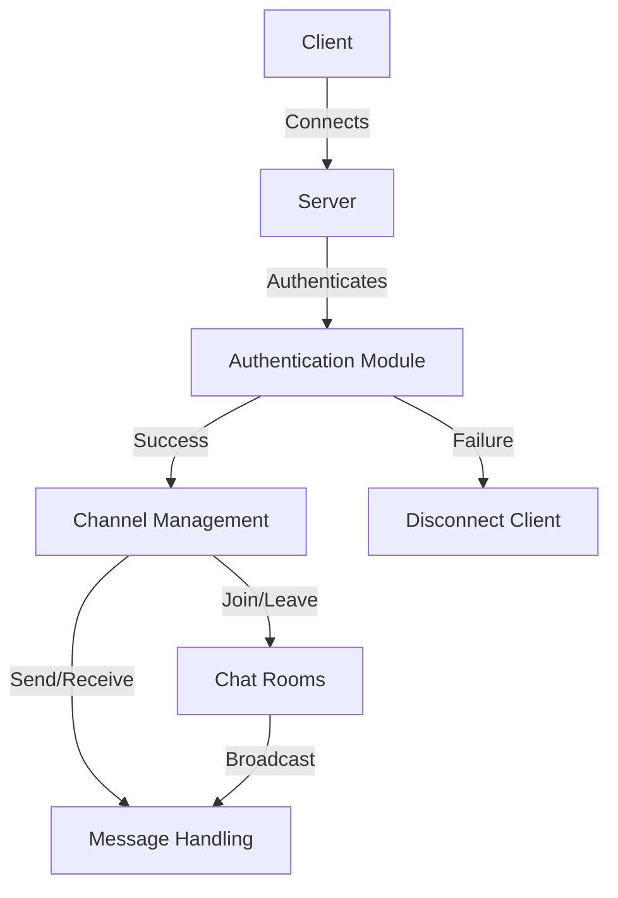

# Ft_IRC

## Project Overview
Ft_IRC is a custom implementation of an IRC (Internet Relay Chat) server. It is designed to provide a lightweight, efficient, and standards-compliant IRC server that supports multiple clients, channels, and commands. The project adheres to the RFC 2812 specification for the IRC protocol, ensuring compatibility with standard IRC clients.

This project is built using C++ and leverages system-level programming concepts such as socket programming, epoll for event handling, and signal handling for graceful shutdowns.

## Features
- **Client Authentication**: Supports password-based authentication for clients.
- **Channel Management**: Create, join, and manage channels with features like invite-only channels, topic protection, and user limits.
- **User Commands**: Implements core IRC commands such as:
  - `PASS`: Authenticate with the server.
  - `NICK`: Set or change the nickname.
  - `USER`: Register a user.
  - `JOIN`: Join a channel.
  - `INVITE`: Invite a user to a channel.
  - `KICK`: Remove a user from a channel.
  - `MODE`: Set channel modes (e.g., invite-only, topic protection).
  - `TOPIC`: Set or view the channel topic.
  - `PRIVMSG`: Send private messages to users or channels.
  - `PING`: Check server connectivity.
  - `QUIT`: Disconnect from the server.
- **Error Handling**: Provides detailed error messages for invalid commands, insufficient parameters, and other issues.
- **Scalability**: Uses epoll for efficient event handling, allowing the server to handle multiple clients simultaneously.
- **Graceful Shutdown**: Handles system signals (e.g., `SIGINT`, `SIGQUIT`, `SIGTSTP`) to cleanly close all sockets and resources.

## How It Works
1. **Server Initialization**:
   - The server is started with a specified port and password.
   - A socket is created, bound to the port, and set to listen for incoming connections.
   - An epoll instance is created to monitor events on the server and client sockets.

2. **Client Connection**:
   - When a client connects, the server accepts the connection and adds the client socket to the epoll instance.
   - The client is prompted to enter the server password for authentication.

3. **Command Processing**:
   - The server reads messages from clients and parses them into commands.
   - Commands are processed based on the client's state (e.g., authentication, channel operations).
   - Responses are sent back to the client, including success messages, errors, or requested data.

4. **Channel Management**:
   - Clients can create and join channels, with options for invite-only access, topic protection, and user limits.
   - Channel operators can manage users and set channel modes.

5. **Message Handling**:
   - Clients can send private messages to other users or broadcast messages to channels.
   - The server ensures that messages are delivered only to authorized recipients.

6. **Graceful Shutdown**:
   - The server listens for system signals to initiate a shutdown.
   - All client and server sockets are closed, and resources are released.

## Diagram

Below is a flowchart illustrating the server's workflow and how a client connects:



## Setup Instructions
### Prerequisites
- A C++ compiler that supports C++98 (e.g., `g++`).
- A Unix-based operating system (Linux or macOS).

### Build
1. Clone the repository:
   ```bash
   git clone <repository-url>
   cd Ft_IRC
   ```
2. Build the project using the provided `Makefile`:
   ```bash
   make
   ```

### Run
Start the server with the following command:
```bash
./ircserv <port> <password>
```
- Replace `<port>` with the desired port number (e.g., `6667`).
- Replace `<password>` with the server password.

### Clean
To clean up compiled files, run:
```bash
make clean
```
To remove the executable as well, run:
```bash
make fclean
```

## Lessons Learned
Building Ft_IRC provided valuable insights into:
- **Socket Programming**: Understanding how to create, bind, listen, and accept connections on sockets.
- **Event-Driven Programming**: Using epoll for efficient event handling in a multi-client environment.
- **Protocol Design**: Implementing a protocol-compliant server based on RFC specifications.
- **Error Handling**: Designing robust error messages and handling edge cases.
- **Resource Management**: Ensuring proper cleanup of sockets and resources during shutdown.
- **Concurrency**: Managing multiple clients simultaneously without blocking operations.
